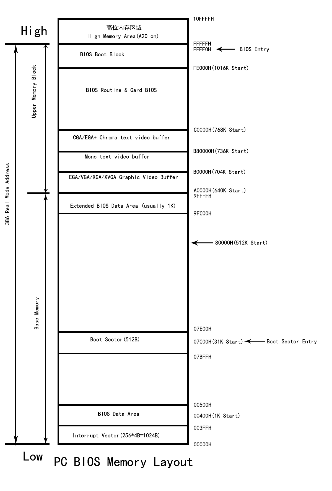

# day 02

## CPU寄存器名字

* 16位寄存器

  * AX    accumulator，累加寄存器
  * CX    counter，计数寄存器
  * DX    data，数据寄存器
  * BX    base，基址寄存器
  * SP    stack pointer，栈指针寄存器
  * BP    base pointer，基址指针寄存器
  * SI    source index，源变址寄存器
  * DI    destination index，目的变址寄存器

* 8位寄存器

  * AL    累加寄存器低位
  * CL    计数寄存器低位
  * DL    数据寄存器低位
  * BL    基址寄存器低位
  * AH    累加寄存器高位
  * CH    计数寄存器高位
  * DH    数据寄存器高位
  * BH    基址寄存器高位

* 32位寄存器

  16位的扩展

  * EAX
  * ECX
  * EDX
  * EBX
  * ESP
  * EBP
  * ESI
  * EDI

* 段寄存器

  * ES    附加段寄存器（extra segment）
  * CS    代码段寄存器（code segment）
  * SS    栈段寄存器（stack segment）
  * DS    数据段寄存器（data segment）
  * FS    段节2（segment part 2）
  * GS    段节3（segment part 3）

## bios内存分布

### 概述

计算机开机后的第一件事是读取ROM芯片中的bios，此时系统工作在实模式下，寻址范围只有1MB（0x00000 ~ 0xFFFFF)。



### 内存分布

* 0x00000 ~ 0x9FFFF: 基本内存（640KB）

  ```assembly
  0x00000 ~ 0x003FF: 中断向量表（1024B）
  0x00400 ~ 0x004FF: bios数据区（256B）
  0x00500 ~ 0x07BFF: 自由内存区
  0x07C00 ~ 0x07DFF: 引导程序加载区（512B）
  0x07E00 ~ 0x9FFFF: 自由内存区
  ```

* 0xA0000 ~ 0xBFFFF: 显存（128KB）

  ```assembly
  0xA0000 ~ 0xAFFFF: EGA/VGA/XGA/XVGA图形视频缓冲区（64KB）
  0xB0000 ~ 0xB7FFF: Mono text video buffer（32KB）
  0xB8000 ~ 0xBFFFF: CGA/EGA+ chroma text video buffer（32KB）
  ```

* 0xC0000 ~ 0xFFFFF: bios自己使用（256KB）

  ```assembly
  0xC0000 ~ 0xC7FFFF: 显卡bios使用（32KB）
  0xC8000 ~ 0xCBFFFF: ide控制器bios使用（16KB）
  0xCC000 ~ 0xEFFFFF: 
  0xF0000 ~ 0xFFFFFF: 系统bios使用（64KB）
  ```

  


